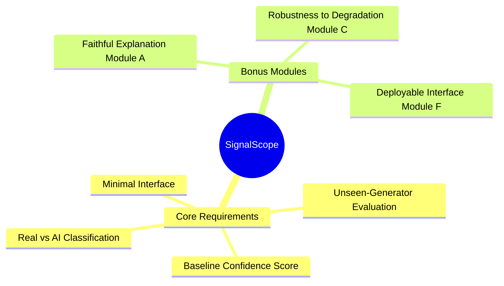

# Core Features

This document outlines the mandatory requirements and optional extensions targeted by SignalScope.

## 1. Feature Map Flowchart

## 2. Mandatory Core Features
- **Real-vs-AI-generated Image Classification:** The foundation of the system.
- **Baseline Confidence Score:** The Django response includes softmax class probabilities, but they are not calibrated and must not be interpreted as reliable confidence until a trained model and calibration procedure are added.
- **Evaluation:** Must report ROC-AUC, Macro-F1, Accuracy, and FPR specifically isolating the unseen-generator split.

## 3. Targeted Bonus Modules
- **Module A - Faithful Explanation:** Localizing suspicious visual cues (implausible textures, anatomical errors) with human-readable text and visual heat-maps.
- **Module C - Robustness to Degradation:** Ensuring the model maintains high accuracy when subjected to common real-world transformations (compression, cropping, resizing).
- **Module F - Basic Interface:** A Next.js upload interface is connected to the Django API. Production deployment and latency validation remain pending.
