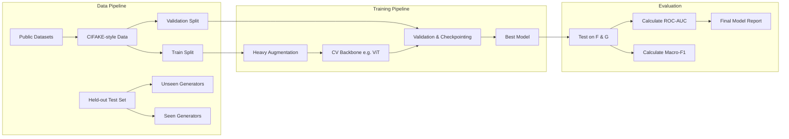

# ML Architecture and Pipeline

This document details the machine learning lifecycle for SignalScope, particularly focusing on the core challenge: generalizing to unseen generators.

## 1. ML Lifecycle Flowchart

## 2. Current Baseline and Planned Model Selection
The runnable baseline is `SimpleCNN`, a two-convolution JAX/Flax classifier operating on normalized 224×224 RGB images. It is connected to Django for end-to-end development but currently initializes random parameters and is not a valid detector.

Future experiments should prioritize backbones that handle both spatial and frequency artifacts:
- **Vision Transformers (ViT):** Excellent at capturing global context and subtle inconsistencies across the image.
- **Robust CNNs:** (e.g., EfficientNet, ConvNeXt) which provide strong baseline performance and computational efficiency.

## 3. Generalization Strategy
To maximize the primary metric (Unseen-generator ROC-AUC):
- **Domain Adaptation:** Applying techniques to align feature distributions between known generators.
- **Data Augmentation:** Extensive use of frequency-domain augmentations (e.g., JPEG compression, Gaussian blur, random noise) to force the model to learn deep semantic inconsistencies rather than superficial generator-specific artifacts.
