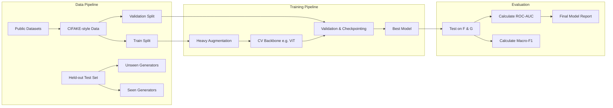

# ML Architecture and Pipeline

This document details the machine learning lifecycle for SignalScope, particularly focusing on the core challenge: generalizing to unseen generators.

## 1. ML Lifecycle Flowchart

## 2. Current Baseline and Experimental Models
The runnable baseline uses a ResNet18 PyTorch classifier operating on normalized 224×224 RGB images. It is connected to Django for end-to-end inference and loads the trained checkpoint (`cifake_resnet18.pt`) to provide live predictions on the web interface.

In addition to the baseline, the project actively evaluates experimental models to improve generalization:
- **CLIP Linear Probes (`clip_linear_probe.pt` & `v2`):** Vision Transformer-based models being trained and evaluated offline (via scripts like `evaluate_unseen_generators.py`) to test robustness against unseen AI generators.
- **Robust CNNs:** (e.g., EfficientNet, ConvNeXt) which provide strong baseline performance and computational efficiency.

## 3. Generalization Strategy
To maximize the primary metric (Unseen-generator ROC-AUC):
- **Domain Adaptation:** Applying techniques to align feature distributions between known generators.
- **Data Augmentation:** Extensive use of frequency-domain augmentations (e.g., JPEG compression, Gaussian blur, random noise) to force the model to learn deep semantic inconsistencies rather than superficial generator-specific artifacts.
