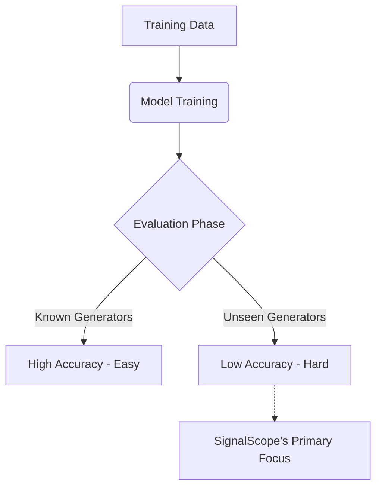

# Problem Statement

## Background
In the age of Generative AI, text-to-image models can produce photorealistic media in seconds. This capability introduces significant risks, including the rapid spread of misinformation, sophisticated fraud, and the creation of manipulated evidence.

## The Core Challenge
While many detection systems can achieve high accuracy on images generated by models they were trained on (e.g., Stable Diffusion 1.4), they often fail catastrophically when presented with images from novel, unseen generators (e.g., Midjourney v6). 

**The primary objective of SignalScope is to solve this generalization problem.**

## Key Requirements
1. Classify images as real or AI-generated.
2. Produce a calibrated confidence score.
3. Maximize performance on the **unseen-generator split**.
