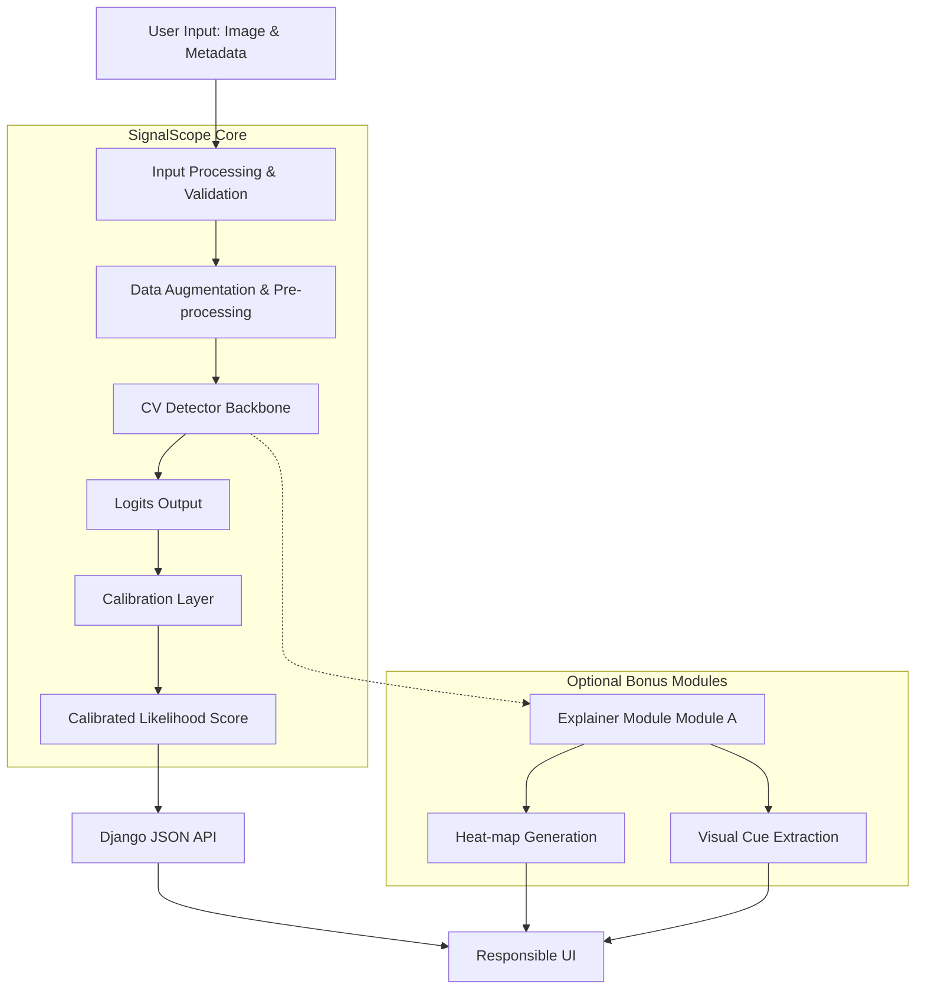

# System Overview

The SignalScope architecture is designed for robust evaluation and deployment of real-vs-synthetic classification models. It is built to accept diverse image inputs, process them securely, predict their authenticity using state-of-the-art computer vision models, and optionally explain the findings.

## 1. Architecture Flowchart

## 2. Input Processing
- **Image Validation:** Ensures the uploaded image meets resolution and format requirements.
- **Pre-processing:** Standardizes the image dimensions and applies necessary normalization techniques suited for the specific CV backbone (e.g., standard ImageNet normalizations).

## 3. Detection (CV Detector)
- Uses a computer-vision model (CNN such as ResNet or ViT) tuned for artifact detection and high-frequency spectral analysis.

## 4. Calibration & Explanation
- **Calibrated Verdict:** Converts raw logits into calibrated confidence scores (e.g., using Platt scaling or Isotonic Regression) to prevent over-confidence.
- **Explainer:** Leverages techniques like Grad-CAM to generate visual heat-maps of suspicious regions.

## 5. Django API and User Interface
- **Django API:** The current implementation accepts an in-memory upload at /api/predict/, applies ImageNet-style normalization, and calls the PyTorch model.
- **Responsible UI:** The Next.js interface uploads an image to Django and frames results as likelihoods. It warns when inference comes from the untrained development baseline.
