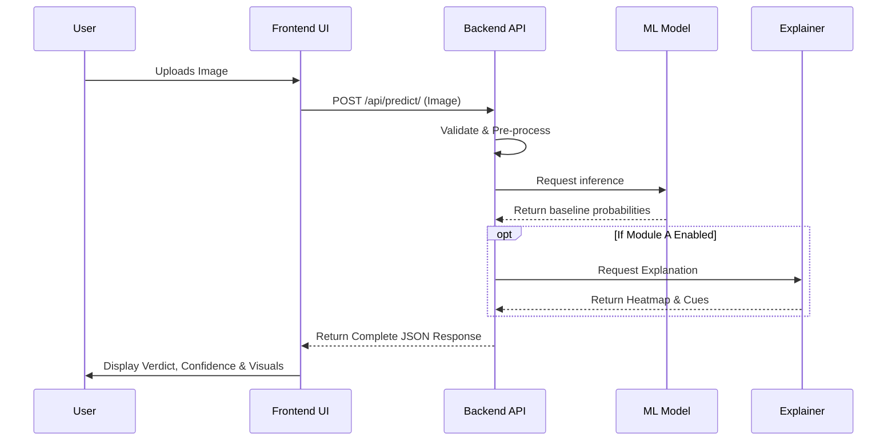

# User Workflows

Understanding the user interaction with SignalScope is crucial. The primary goal is to provide a seamless, informative, and safe experience when a user checks an image for authenticity.

## 1. Interaction Flowchart

## 2. Core Actions
- **Upload:** Users can drag-and-drop images or upload them via standard dialogs.
- **Analysis State:** During analysis, users see a non-blocking loading state indicating processing.
- **Verdict Display:** The UI uses likelihood wording and, while the model remains untrained, displays a development-baseline warning.
- **Explanation Review:** Heat-map overlay and grounded visual cues are planned; the current explanation endpoint returns limitation text instead of fabricated cues.
