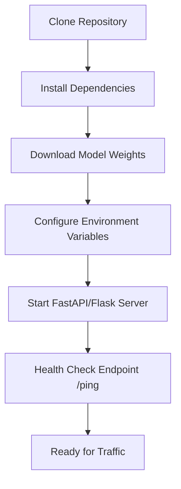

# How to Deploy the Backend

This guide outlines the steps to deploy the SignalScope backend API, ensuring it is ready for integration with the frontend UI.

## 1. Deployment Flowchart



## 2. Steps
1. **Environment Setup:** 
   ```bash
   python -m venv venv
   source venv/bin/activate
   pip install -r requirements.txt
   ```
2. **Model Weights:** Ensure the `.pth` or `.onnx` model weights are placed in `model/weights/`.
3. **Start the Server:** Use Uvicorn to run the FastAPI application:
   ```bash
   uvicorn src.backend.main:app --host 0.0.0.0 --port 8000 --reload
   ```
4. **Verify:** Navigate to `http://localhost:8000/docs` to view the Swagger UI and test the API endpoints.
