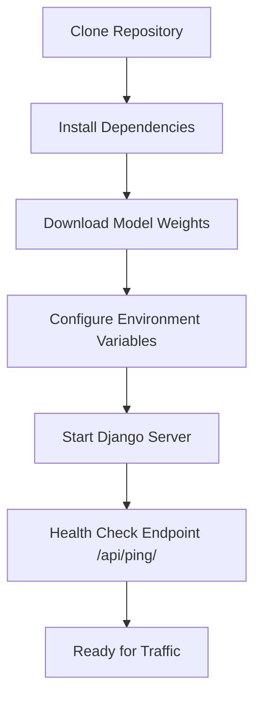

# How to Deploy the Backend

This guide outlines the steps to deploy the SignalScope backend API, ensuring it is ready for integration with the frontend UI.

## 1. Deployment Flowchart



## 2. Steps
1. **Environment Setup:** 
   ```bash
   python -m venv venv
   source venv/bin/activate
   pip install -r requirements.txt
   ```
2. **Model Weights:** The current baseline initializes model parameters in memory. Add a validated checkpoint-loading step before deployment; do not present baseline outputs as production predictions.
3. **Start the Server:** Use Django's development server:
   ```bash
   python3 backend/manage.py runserver 8000
   ```
4. **Verify:** Request `http://localhost:8000/api/ping/`, then submit an image as multipart form field `image` to `POST /api/predict/`.
