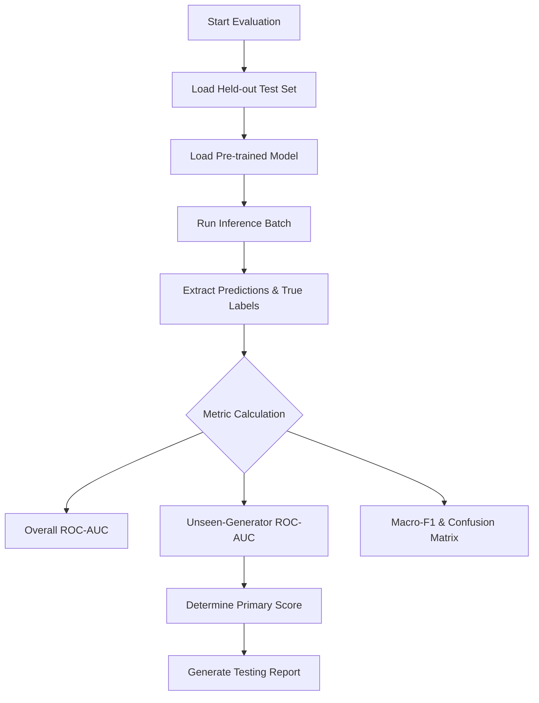

# How to Run Evaluation

This guide explains how to properly evaluate the SignalScope model, compute the primary metrics, and generate a report.

## 1. Evaluation Workflow



## 2. Steps
1. **Prepare Data:** Ensure the held-out test dataset is placed in the designated directory (e.g., `data/test/`). The data must contain annotations differentiating seen vs. unseen generators.
2. **Execute Script:** Run the evaluation script provided in the repository:
   ```bash
   python model/inference/evaluate.py --data_dir data/test --weights checkpoints/best_model.pth
   ```
3. **Analyze Output:** The script will output the metrics to the console and generate a detailed report in `report/model-report/`. Pay close attention to the `Unseen-Generator ROC-AUC` as this is the primary tie-breaker.
