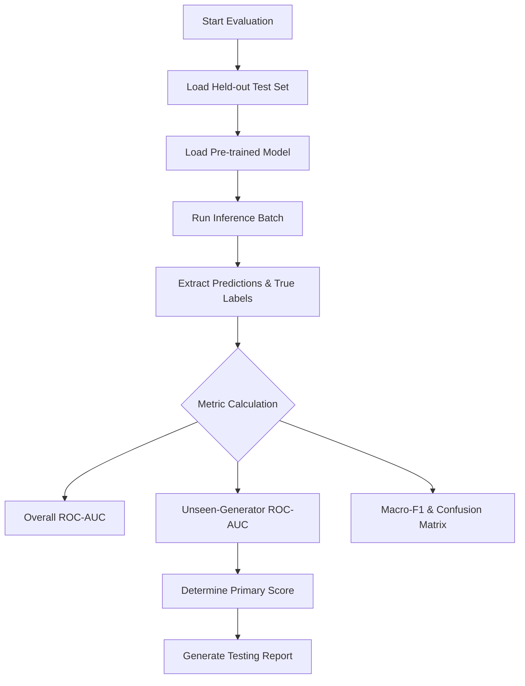

# How to Run Evaluation

This guide describes the required evaluation process. `model/inference/evaluate.py` currently provides reusable evaluation functions for a validation loader, but it is not yet a command-line evaluation runner and does not load saved weights.

## 1. Evaluation Workflow

## 2. Steps
1. **Prepare Data:** Ensure the held-out test dataset is placed in the designated directory (e.g., `data/test/`). The data must contain annotations differentiating seen vs. unseen generators.
2. **Implement the evaluation runner:** Add checkpoint loading, test-data annotations, seen/unseen generator grouping, and report output before executing a held-out evaluation.
3. **Analyze Output:** Report overall AUC, unseen-generator AUC, Macro-F1, confusion matrix, accuracy, and FPR from a trained checkpoint. The current untrained integration baseline cannot produce reportable metrics.
