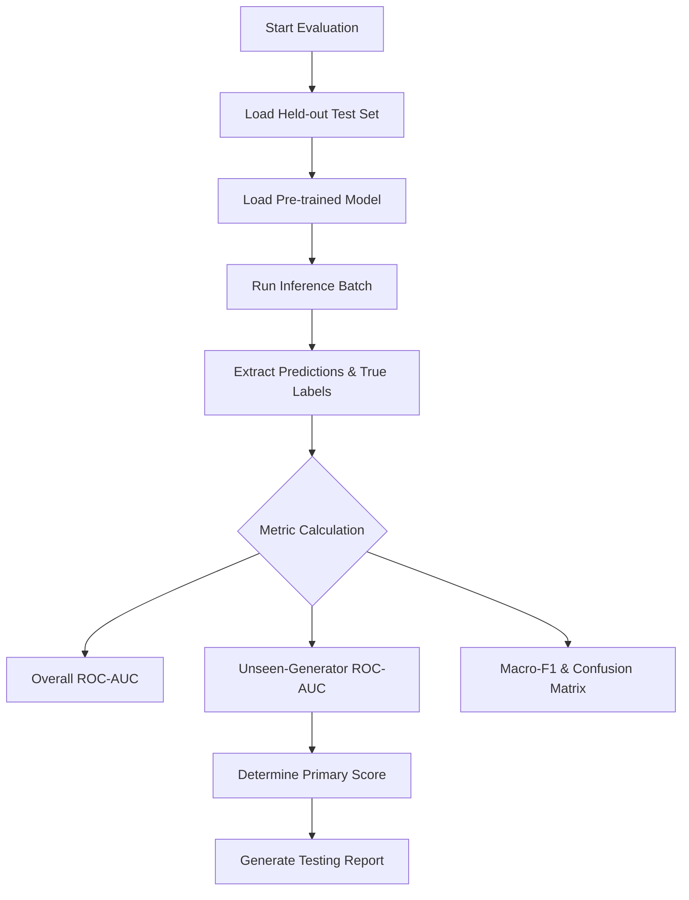

# How to Run Evaluation

This guide describes the required evaluation process. `model/training/train_cifake.py` provides the evaluation runner and will calculate metrics on the dataset's test split, saving the output to a JSON report. Note that an alternative evaluation script exists at `model/inference/evaluate.py`, but it uses a different ML framework (JAX/Flax) and does not test the deployed PyTorch baseline.

## 1. Evaluation Workflow

## 2. Steps
1. **Prepare Data:** Ensure the held-out test dataset is placed in the designated directory (e.g., `data/test/`). The data must contain annotations differentiating seen vs. unseen generators.
2. **Run Evaluation:** Execute the evaluation pipeline by running `python model/training/train_cifake.py` from the project root. This will calculate metrics on the test set and automatically output the results to `report/model-report/cifake_resnet18_metrics.json`.
3. **Analyze Output:** Report overall AUC, unseen-generator AUC, Macro-F1, confusion matrix, accuracy, and FPR from a trained checkpoint.
