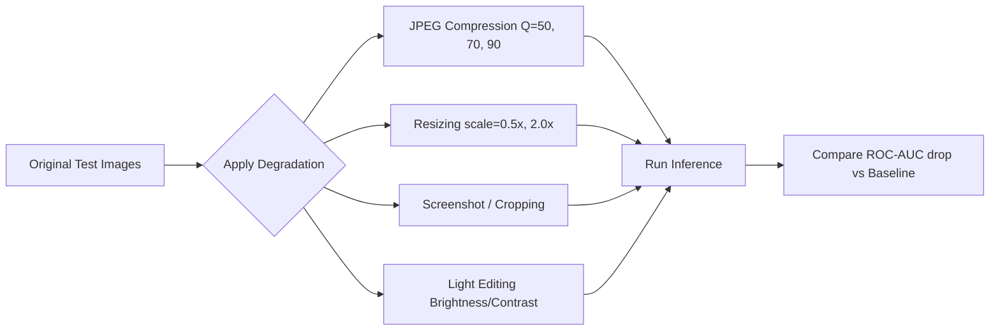

# How to Test Robustness

SignalScope must perform reliably even when images are compressed, resized, or lightly edited (Module C). This guide outlines how to execute the robustness testing suite.

## 1. Robustness Pipeline



## 2. Steps
1. **Configure Pipeline:** Define the degradation parameters in the configuration file (`configs/robustness.yaml`).
2. **Run Robustness Suite:** Execute the robustness testing script:
   ```bash
   python model/inference/test_robustness.py --config configs/robustness.yaml
   ```
3. **Review Results:** The script will generate a series of plots in `report/` showing the degradation-vs-accuracy curves. Ensure the performance drop remains within acceptable limits.
