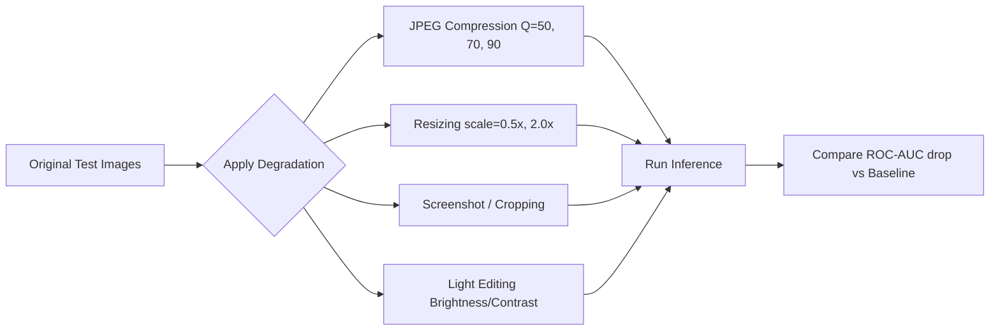

# How to Test Robustness

SignalScope must perform reliably even when images are compressed, resized, or lightly edited (Module C). This guide records the planned robustness protocol; the referenced configuration and test script have not yet been implemented.

## 1. Robustness Pipeline

## 2. Steps
1. **Configure Pipeline:** Define the degradation parameters in the configuration file (`configs/robustness.yaml`).
2. **Implement the suite:** Add the degradation configuration and test runner before running this protocol.
3. **Review Results:** Record degradation-vs-accuracy curves in `report/` only after testing a trained checkpoint. Do not report results from the current untrained integration baseline.
