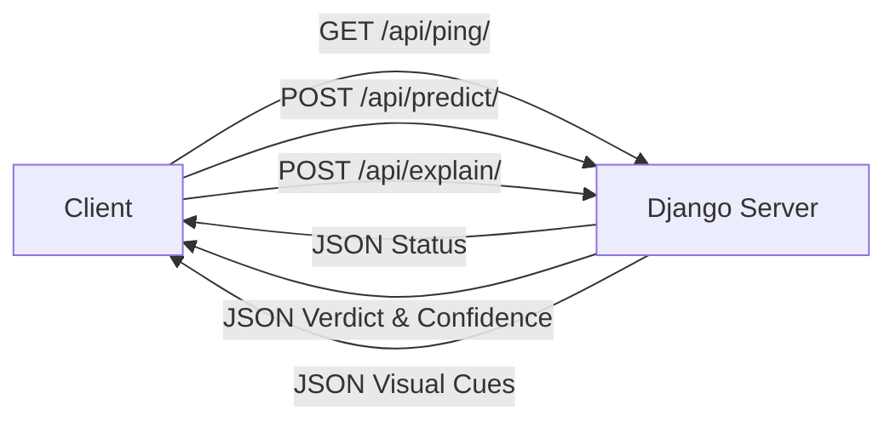

# API Endpoints

This document describes the REST API endpoints exposed by the Django SignalScope backend. The implementation lives in `backend/detector/` and imports the PyTorch/ResNet18 inference helpers directly; FastAPI is not used.

## 1. API Architecture



## 2. Endpoints

### `GET /api/ping/`

Health check endpoint.

- **Response:** `{"status": "ok"}`

### `POST /api/predict/`

Accepts an image and returns the classification verdict.

- **Request Body:** `multipart/form-data` with key `image` (file).
- **Checkpoint behavior:** If no trained checkpoint is present, the backend serves a development baseline and returns `is_trained_model: false` rather than failing with 503.
- **Response:**
  ```json
  {
    "verdict": "Likely AI-generated",
    "confidence": 88.0,
    "ai_probability": 88.0,
    "real_probability": 12.0,
    "is_trained_model": false,
    "threshold_used": 0.5
  }
  ```

### `POST /api/explain/` (development placeholder)

Accepts an image and returns the prediction with safe limitation text. It does not yet create a heatmap.

- **Request Body:** `multipart/form-data` with key `image` (file).
- **Response:**
  ```json
   {
    "verdict": "Likely AI-generated",
    "confidence": 88.0,
    "ai_probability": 88.0,
    "real_probability": 12.0,
    "is_trained_model": false,
    "threshold_used": 0.5,
    "visual_cues": [
      "Explanation heatmaps are not available in the current baseline.",
      "This assessment must not be treated as proof of image provenance."
    ]
  }

  ```
