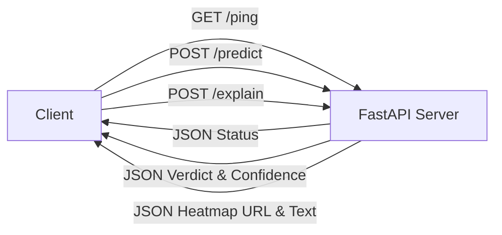

# API Endpoints

This document describes the REST API endpoints exposed by the SignalScope backend.

## 1. API Architecture


## 2. Endpoints

### `GET /ping`
Health check endpoint.
- **Response:** `{"status": "ok"}`

### `POST /predict`
Accepts an image and returns the classification verdict.
- **Request Body:** `multipart/form-data` with key `image` (file).
- **Response:**
  ```json
  {
    "verdict": "Likely AI-generated",
    "confidence": 0.88,
    "threshold_used": 0.5
  }
  ```

### `POST /explain` (Module A)
Accepts an image and returns visual cues and a heatmap.
- **Request Body:** `multipart/form-data` with key `image` (file).
- **Response:**
  ```json
  {
    "heatmap_url": "/static/heatmaps/uuid.png",
    "visual_cues": [
      "Implausible textures detected in the background.",
      "Lighting inconsistencies around the primary object."
    ]
  }
  ```
