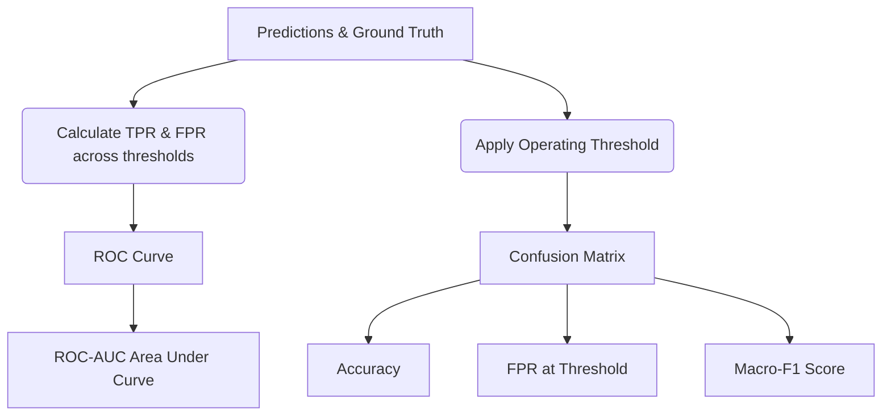

# Evaluation Metrics

This document formally defines the metrics used to evaluate SignalScope, adhering strictly to the SIH 2026 Problem Statement 2 guidelines.

## 1. Metric Calculation Flow

## 2. Primary Metric: ROC-AUC
**Receiver Operating Characteristic - Area Under Curve**
- **Overall ROC-AUC:** Evaluated across the entire held-out test set.
- **Unseen-Generator ROC-AUC:** Evaluated *only* on the subset of images generated by models not present in the training data. **This is the primary priority and main tie-breaker.**

## 3. Secondary Metrics
- **Macro-F1:** The unweighted mean of the F1 scores calculated for each class (Real vs AI). Important for ensuring balanced performance.
- **Accuracy:** The percentage of correct predictions at the chosen operating threshold.
- **FPR (False Positive Rate):** The proportion of Real images incorrectly classified as AI-generated at the chosen operating threshold.
