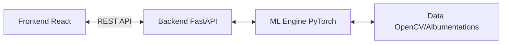

# Technology Stack

This document lists the core technologies, libraries, and frameworks utilized in the SignalScope project.

## 1. Machine Learning & Data Processing
- **PyTorch:** The primary framework for model training, evaluation, and inference. Chosen for its flexibility and extensive ecosystem.
- **Torchvision & Hugging Face Transformers:** Utilized for accessing pre-trained CNN (ResNet, EfficientNet) and ViT backbones.
- **Scikit-learn:** Used for computing robust evaluation metrics (ROC-AUC, Macro-F1).
- **OpenCV & Albumentations:** High-performance libraries for image I/O, pre-processing, and extensive data augmentation (crucial for generalization).

## 2. Backend Application
- **FastAPI:** A modern, high-performance web framework for building the prediction API. It provides asynchronous capabilities and automatic interactive documentation (Swagger UI).
- **Uvicorn:** ASGI server implementation for FastAPI.

## 3. Frontend Application (Module F)
- **React (or Vue/Vanilla JS):** For building the responsible, drag-and-drop web interface.
- **Tailwind CSS (Optional):** For rapid and consistent styling of the UI components.

## Stack Diagram

