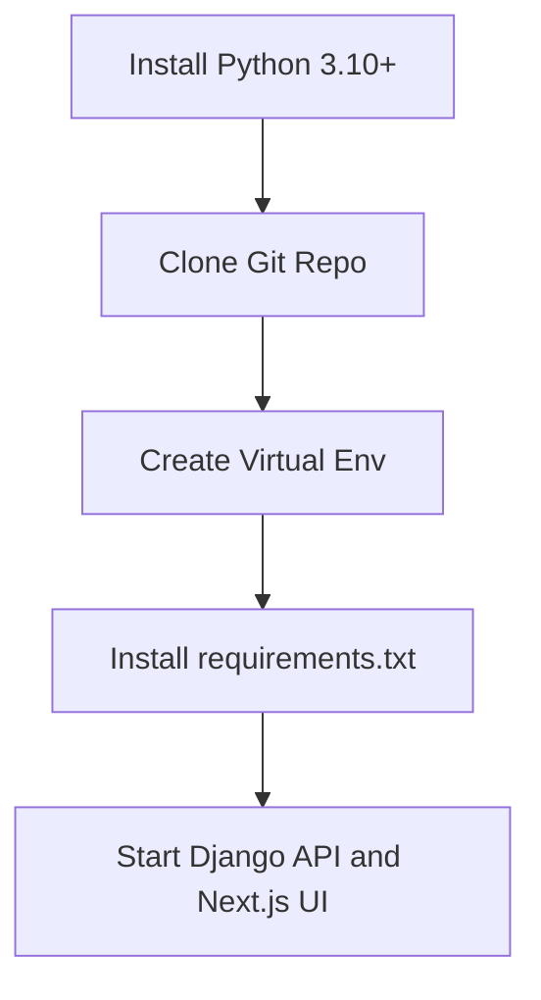

# Getting Started Tutorial

Welcome to SignalScope! This tutorial will guide you through setting up your environment, running a baseline model, and testing the system with a single image.

## 1. Setup Flowchart



## 2. Step-by-Step Instructions

**Step 1: Clone the Repository**
```bash
git clone https://github.com/arththakkar1/signal-scope-web-app.git
cd signal-scope-web-app
```

**Step 2: Create a Virtual Environment**
It is highly recommended to isolate your dependencies.
```bash
python3 -m venv venv
source venv/bin/activate  # On Windows: venv\Scripts\activate
```

**Step 3: Install Dependencies**
```bash
pip install -r requirements.txt
```

**Step 4: Start the Django API**
```bash
python3 backend/manage.py runserver 8000
```

**Step 5: Start the frontend**
Open another terminal and run:
```bash
cd frontend
npm install
npm run dev
```

Open `http://localhost:3000`, choose an image, and select **Analyze image**. The current model is an untrained integration baseline; its output validates the request path only and must not be used as a real authenticity assessment.
