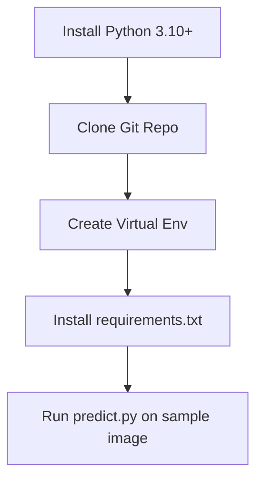

# Getting Started Tutorial

Welcome to SignalScope! This tutorial will guide you through setting up your environment, running a baseline model, and testing the system with a single image.

## 1. Setup Flowchart



## 2. Step-by-Step Instructions

**Step 1: Clone the Repository**
```bash
git clone https://github.com/arththakkar1/signal-scope-web-app.git
cd signal-scope-web-app
```

**Step 2: Create a Virtual Environment**
It is highly recommended to isolate your dependencies.
```bash
python3 -m venv venv
source venv/bin/activate  # On Windows: venv\Scripts\activate
```

**Step 3: Install Dependencies**
```bash
pip install -r requirements.txt
```

**Step 4: Run a Prediction**
We have provided a sample script to test the model on a single image.
```bash
python model/predict/predict.py --image sample.jpg
```
*Expected Output:*
```json
{
  "verdict": "Likely AI-generated",
  "confidence": 0.92
}
```
